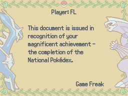

# Diploma
This script is for Pokémon Essentials. It displays a game diploma like in official games. This is a very simple scene that I made with a lot of comments that can be used to understand how simple scenes work in Essentials.

## Screens

## Installation
Follow the [Script](/Script.rb) instructions. The sample script files are in [Files folder](/Files).